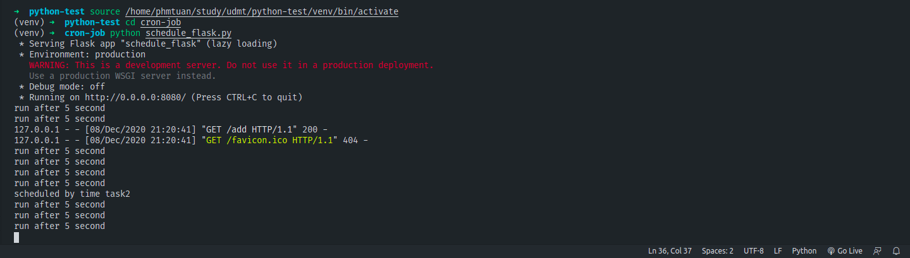

## Cron Job

**What is cron job?** a *cron job* is a linux command used for scheduling tasks to be executed in specific time in future. It's normally used to schedule a job that is executed periodically.

This post will discuss about how to schedule a job to run in specific time in future with python and flask framework

##  Cron Job with Python
We will use python library [APScheduler](https://apscheduler.readthedocs.io/en/latest/userguide.html) to start more quickly and schedule running task easily

**First**, install dependencies
```bash
pip install apscheduler
```

**Second**, import requirements
```
from apscheduler.schedulers.background import BackgroundScheduler
from datetime import datetime, date, time
```

*Create an instance of BackgroundScheduler, and create some func to execute task*
```python
schedule = BackgroundScheduler()

def daily_job():
  print("daily job")

def one_time_job():
  print("one_time job")

# List of jobs to executed
tasks_list = [
  (date(2020, 12, 8), time(14, 33), 'one_time'),
  (date(2020, 12, 8), time(14, 34), 'daily')
]

for task_date, task_time, frequency in tasks_list:
  if frequency == "one_time":
    run_date = datetime.combine(task_date, task_time)
    schedule.add_job(func=one_time_job, trigger="date", run_date=run_date)
  else if frequency == "daily":
    run_date = datetime.combine(task_date, task_time)
    schedule.add_job(func=daily_job, trigger="interval", days=1)
```

**And Then**, start to run
```python
schedule.start()
```

It's quite simple, we have two cases above, they are triggered by "interval" or "date"
I'll explain them:
1. **Interval** (action will trigger intervals) with many params like:
  - weeks *(int)* – number of weeks to wait
  - days *(int)* – number of days to wait
  - hours *(int)* – number of hours to wait
  - minutes *(int)* – number of minutes to wait
  - seconds *(int)* – number of seconds to wait
  - start_date *(datetime|str)* – starting point for the interval calculation
  - end_date *(datetime|str)* – latest possible date/time to trigger on
  - timezone *(datetime.tzinfo|str)* – time zone to use for the date/time calculations

  **In the example above**, i trigger it by interval, it will run function daily_job, you can try it with different params such as hours, seconds, etc...
  You can also specify starting date and ending date for the schedule through ```start_date``` and ```end_date``` parameters

2. **Date**(Triggers once on the given datetime by ```run_date``` param), others params:
  - run_date *(datetime|str)* – the date/time to run the job at
  - timezone *(datetime.tzinfo|str)* – time zone for run_date if it doesn’t have one already
  
  If ```run_date``` is empty, it will use current time
  ```time_zone``` use for specify time zone

## With Flask
With flask, we can use [Flask-APScheduler](https://github.com/viniciuschiele/flask-apscheduler), it's a Flask entension which adds support for the APScheduler

**Installation**
```bash
pip install Flask-APScheduler
```

**Import dependencies**
```python
from flask import Flask
from flask_apscheduler import APScheduler
from datetime import datetime, date, time
```

Create instances of flask and flask apscheduler
```python
app = Flask(__name__)
scheduler = APScheduler()

# example route
@app.route("/")
def index():
  return "Welcome to the scheduler"

# exe func
def scheduler_task_1():
  print("scheduled task 1")

def scheduler_task_2():
  print("scheduled task 2")
```

**To add more tasks, we create route, we can provide body like input time, type of run. For example, i just create a new normal task when being requested to /add:**
```python
@app.route('/add')
def add_job():
  run_date = datetime.combine(date(2020, 12, 8), time(14, 59))
  scheduler.add_job(id="example", func=scheduler_task_2, trigger="date", run_date = run_date)
  return "add new task success"
```

And we run flask app, start scheduler:
```python
if __name__ == "__main__":
  scheduler.add_job(id="scheduled task", func=scheduler_task_1, trigger="interval", seconds=5)
  scheduler.start()
  app.run(host="0.0.0.0", port=8080)
```

**Finally, this is our result:**



For further details: [APScheduler](https://apscheduler.readthedocs.io/en/latest/userguide.html), [Flask-APScheduler](https://github.com/viniciuschiele/flask-apscheduler)